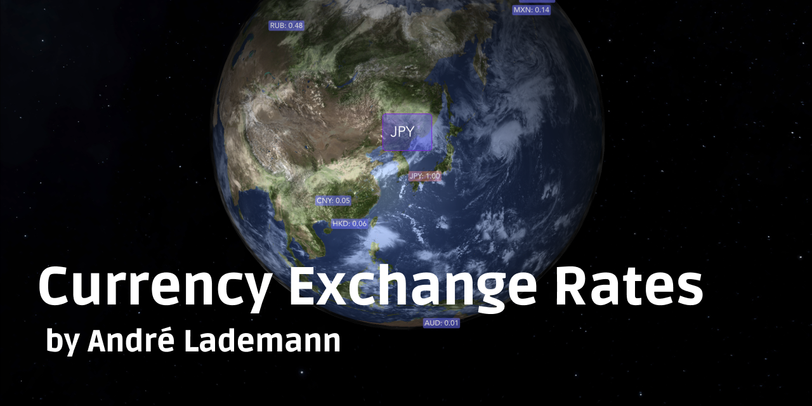

# Currency exchange rate visualization

[](https://github.com/vergissberlin/resume-currencies/actions/workflows/build-and-deploy.yml)

Visualisation of currency exchange rates as prototype with threejs.



## Architecture

This project is baseed on Three.js. As data source, the Free Currency API is used. The API is used to get the currency data for the selected date. The data is then used to calculate the position of the countries on the globe. The globe is then rotated to the selected currency.


## Improvements

This is an prototype of a currency visualization. It is not finished and there are a lot of improvements to be made. If you want to contribute, feel free to open a pull request.

### Add Functionality

This project is not in final state.
To be useful, the following features need to be added:

- [ ] List view of all currencies with their current value under the globe
- [ ] Rotate the earth to selected currency
- [ ] Color the countries based on currency value (🟥 = low,  🟩 = high) (Heatmap)
- [ ] On click on a label, open a modal with more information about the currency history
- [ ] Add time slider to change the date of the currency data
- [ ] Add a search bar to search for a currency by country name
- [ ] Add a loading animation
- [ ] Add imprint

### Technical improvements

- [x] Capsulate logic in fuctions
- [x] Add types
- [ ] CORS proxy settings
- [ ] Add unit and e2e tests
- [ ]  Add a 404 page
- [ ]  Add error handling
- [x]  CI/CD pipeline with github actions
- [x]  Use github pages to host the project
- [ ] Add a linter
- [ ] Add a formatter
- [ ] Add a commit message linter
- [x] Reduce the size of the textures
- [ ] Varnish Reverse Proxy for the API to hide the API key and to cache the data

## Development

*Setup and run:*

```bash
yarn
yarn dev
```

## Credits

- Textures <https://www.solarsystemscope.com/textures/>
- API <https://app.freecurrencyapi.com/dashboard>

## License

MIT
